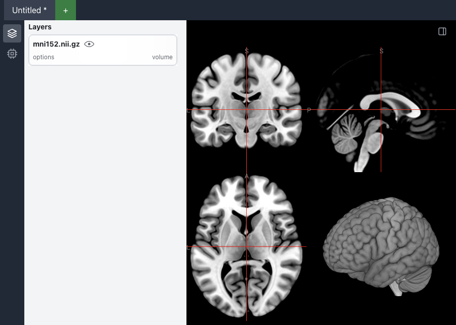
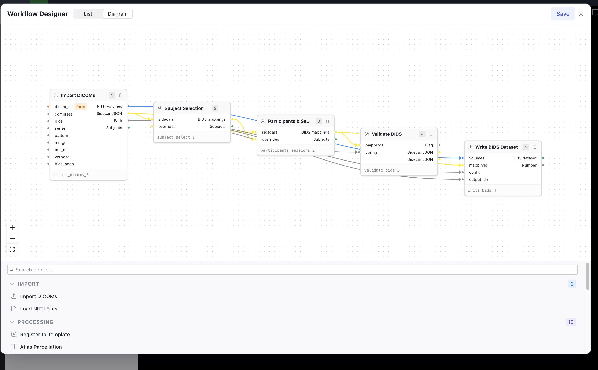
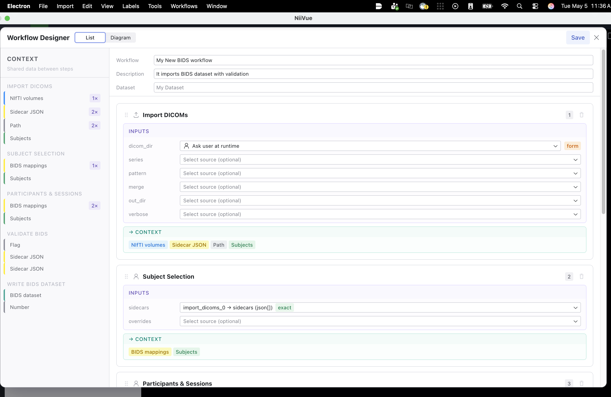
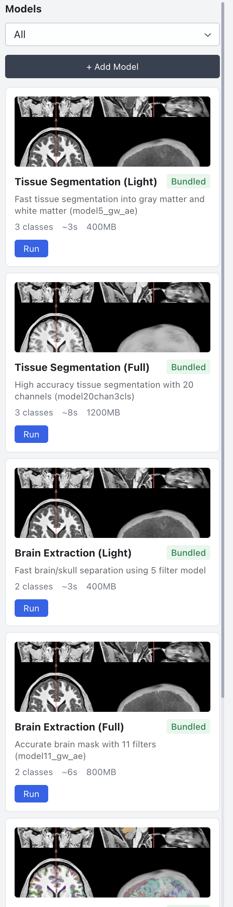

<!-- _class: lead -->

# Workflows in NiiVue Desktop

<div class="columns">
<div>

A declarative pipeline layer for neuroimaging — built on top of the viewer.

<br/>

**Why:** turn "I have a folder of DICOMs" into "I have a BIDS dataset I can visualize" — without leaving the app, and without writing a shell script per study.

<span class="small">niivue-desktop · `packages/niivue-desktop/workflows`</span>

</div>
<div>



</div>
</div>

---

## The gap we're filling

Most labs end up with a fragile chain of:

- `dcm2niix` shell scripts
- a hand-edited Python notebook to write `dataset_description.json`
- someone's `bids-validator` install in a Conda env
- a separate viewer to actually look at the result

Every step has its own error mode. None of it is reproducible across machines.

**Goal:** one app, one declarative workflow file, runs the same way for everyone.

---

## Architecture in one picture

```
 ┌──────────────────┐    ┌─────────────────────┐    ┌────────────────────┐
 │  Tools (.json)   │───▶│ Workflows (.json)   │───▶│ Wizard UI          │
 │  dcm2niix,       │    │  dicom-to-bids,     │    │  (form per         │
 │  bids-classify,  │    │  multi-subject-...  │    │   workflow)        │
 │  allineate, ...  │    │                     │    └────────────────────┘
 └──────────────────┘    └─────────────────────┘            ▲
         ▲                         ▲                        │
         │                         │                ┌────────────────────┐
         │                         └────────────────│  Visual Designer   │
         │                                          │  (drag/drop blocks)│
         └─────── Heuristics (auto-populate context)└────────────────────┘
```

- **Tools** wrap a CLI (`dcm2niix`, `3dAllineate`, ...) or a built-in TS executor.
- **Workflows** chain tools, declare a form, hold per-run context.
- **Heuristics** populate fields the user hasn't filled in yet.

---

## Tool anatomy — `dcm2niix.tool.json`

```json
{
  "name": "dcm2niix",
  "inputs": {
    "dicom_dir": { "type": "dicom-folder" },
    "series":    { "type": "number", "optional": true },
    "compress":  { "type": "string", "default": "y", "enum": ["y","n"] }
  },
  "outputs": {
    "volumes":  { "type": "volume[]" },
    "sidecars": { "type": "json[]" }
  },
  "exec": {
    "binary":   { "name": "dcm2niix", "paths": { "darwin": "...", "linux": "..." } },
    "forEach":  "series",
    "args": [ { "flag": "-z", "input": "compress" }, { "input": "dicom_dir" } ]
  },
  "block": [ { "id": "import-dicoms", "label": "Import DICOMs", "category": "Import" } ]
}
```

One file per tool — schema, exec recipe, and palette block all live together.

---

## Tool anatomy — what each piece does

| Field | Purpose |
|---|---|
| `inputs` / `outputs` | typed contract — drives form fields and binding validation |
| `exec.binary` | per-platform path to the bundled native binary |
| `exec.args` | declarative argv builder (`flag`, `input`, `value`) |
| `exec.forEach` | iterate the binary over an array input (e.g. one call per series) |
| `block` | how this tool appears in the visual designer palette |
| `block.defaults` | pre-wired bindings (e.g. `series → context.selected_series`) |
| `block.exposedFields` / `hiddenFields` | what the form shows vs. hides |
| `block.formComponent` | optional custom React component for the form section |

A new CLI tool ships as **one JSON file + a binary** — no TS edits needed.

---

## Workflow anatomy — `dicom-to-bids.workflow.json`

```json
{
  "name": "dicom-to-bids",
  "inputs":  { "dicom_dir": { "type": "dicom-folder" } },
  "context": { "fields": {
    "selected_series": { "type": "dicom-series[]", "default": [] },
    "series_list":     { "type": "series-mapping[]", "heuristic": "bids-classify" },
    "subjects":        { "type": "subject[]", "heuristic": "detect-subjects" },
    "dataset_name":    { "type": "string", "default": "My Dataset" },
    "output_dir":      { "type": "string" }
  }},
  "form": { "sections": [
    { "title": "Select Series",     "component": "bids-series-filter" },
    { "title": "Subject Selection", "component": "subject-select" },
    { "title": "Classification",    "component": "bids-classification-table" },
    { "title": "Review & Write",    "component": "bids-preview" }
  ]},
  "steps": {
    "convert":  { "tool": "dcm2niix",      "inputs": { "dicom_dir": { "ref": "inputs.dicom_dir" } } },
    "classify": { "tool": "bids-classify", "inputs": { "sidecars": { "ref": "steps.convert.outputs.sidecars" } } },
    "validate": { "tool": "bids-validate", "inputs": { "mappings": { "ref": "context.series_list" } } },
    "write":    { "tool": "bids-write",    "inputs": { "mappings": { "ref": "context.series_list" } } }
  }
}
```

---

## Bindings: how data flows

Every input value is one of three things:

```json
{ "constant": "y" }                                     // literal
{ "ref": "inputs.dicom_dir" }                           // workflow input
{ "ref": "context.output_dir" }                         // form context field
{ "ref": "steps.convert.outputs.sidecars" }             // earlier step's output
```

The engine:

1. Resolves bindings to concrete values when a step is about to run
2. Hashes resolved inputs → caches outputs per step
3. Invalidates downstream steps when a context field they read changes
4. Surfaces missing bindings as form-validation errors before the user clicks Run

No DAG library required — the topology is implicit in the refs.

---

## Heuristics: the auto-populate layer

Form fields with `"heuristic": "..."` get filled in automatically.

Two flavors:

**TypeScript** (in-process, full power):
```ts
const listDicomSeriesHeuristic: HeuristicFn = async (inputs, context) => {
  const dir = (inputs.dicom_dir as string) || (context.dicom_dir as string)
  if (!dir) return []
  return await listDicomSeries(dir)   // scans DICOM headers, returns DicomSeries[]
}
```

**Declarative JSON** (`filter-high-confidence.heuristic.json`):
```json
{ "source": "context.series_list",
  "operations": [{ "op": "filter", "field": "confidence",
                   "operator": "eq", "value": "high" }] }
```

`dependsOn` controls when a heuristic refires — keystrokes don't re-scan disks.

---

## The four built-in workflows

| Workflow | Menu | What it does |
|---|---|---|
| **dicom-to-nifti** | Import | Convert DICOM series to NIfTI; choose compression and filename pattern |
| **dicom-to-bids** | Import | Filter series, classify into BIDS, validate, write a complete dataset |
| **dicom-skull-strip** | Processing | DICOM → NIfTI → `3dAllineate` skull-strip → output folder |
| **multi-subject-acquisition** | Import | Multi-subject pipeline with QC, optional preprocessing, BIDS write |

Each one is a single JSON file in `workflows/workflows/`. Add or fork at will.

---

## Deep dive: dicom-to-bids — the user's view

1. **Pick DICOM folder** → workflow starts, `list-dicom-series` heuristic scans the folder
2. **Filter series** (`bids-series-filter` component) — modality / subject / session lasso
3. **Subject selection** — exclude subjects you don't want to write
4. **Classification table** — review/override BIDS datatype + suffix per series
5. **Dataset metadata** — name, license, authors, README
6. **Review & write** — live BIDS file tree + validator preview, then write

The form is the workflow. No separate config files, no CLI flags to memorize.

<!-- TODO: add screenshot of bids-series-filter (the three-panel modality/subject/session lasso) here as images/wizard-series-filter.png -->
<!-- TODO: add screenshot of bids-preview review-and-write step as images/wizard-bids-preview.png -->
<!-- Capture by running `npm run dev:desktop`, opening Import → DICOM to BIDS, importing a multi-subject DICOM folder, and screenshotting each section. -->


---

## Deep dive: dicom-to-bids — the engine's view

```
Section advance ──► run ready steps up to current section
                    │
                    ├─ convert        (dcm2niix)        ──► sidecars[], volumes[]
                    │                                    ▲
Heuristics fire ────┤                                    │ context.series_list
on section enter    ├─ bids-classify (heuristic)         │   populated via heuristic
                    │   uses sidecars[]                  │   from latest step's
                    │                                    │   sidecars output
                    ├─ validate      (bids-validate)    ──► errors[], warnings[]
                    └─ write         (bids-write)       ──► bids_dir
```

Steps run **one section at a time** so the user can inspect intermediate state.
Heuristics fire **between sections** so context is fresh when the next step needs it.

---

<!-- _class: designer -->

## Visual Designer — two views of the same workflow

<div class="columns">
<div>


<figcaption>Diagram view — typed edges between blocks</figcaption>

</div>
<div>


<figcaption>List view — per-step inputs + shared context</figcaption>

</div>
</div>

<div class="tight">

- **Diagram** — drag-in palette, edges auto-wire compatible types (`volume[]` → `volume[]`)
- **List** — binding badges (`Ask user at runtime`, `exact`, `optional`); `1×`/`2×` flag fan-in
- Round-trip JSON ↔ designer; loader-side **repair pass** heals stale bindings as tools evolve

</div>


---

## Extending: add your own tool

Step 1 — drop a binary in `native-binaries/<platform>/`.
Step 2 — write `mytool.tool.json`:

```json
{
  "name": "mytool",
  "inputs":  { "input_volume": { "type": "volume" }, "threshold": { "type": "number", "default": 0.5 } },
  "outputs": { "output_volume": { "type": "volume" } },
  "exec": {
    "binary": { "name": "mytool", "paths": { "darwin": "native-binaries/darwin/mytool" } },
    "args":   [ { "flag": "-t", "input": "threshold" }, { "input": "input_volume" } ],
    "outputs": { "output_volume": { "collect": "outputFiles" } }
  },
  "block": { "id": "my-tool", "label": "My Tool", "category": "Processing" }
}
```

Restart the app. Your tool is in the palette and usable from any workflow.

---

## Extending: add a heuristic

For simple transforms — declarative JSON (no TS, no rebuild):

```json
{
  "name": "filter-anatomical-only",
  "source": "context.series_list",
  "operations": [
    { "op": "filter", "field": "datatype", "operator": "eq", "value": "anat" }
  ],
  "output": "series-mapping[]"
}
```

For anything that touches the filesystem or runs async logic — register a TS function in `heuristicRegistry.ts`.

Reference it from any workflow's context field via `"heuristic": "filter-anatomical-only"`.

---

## Extending: write a workflow

Compose tools you already have. Example: defacing pipeline.

```json
{
  "name": "deface-anat",
  "inputs":  { "dicom_dir": { "type": "dicom-folder" } },
  "context": { "fields": { "output_dir": { "type": "directory" } } },
  "steps": {
    "convert": { "tool": "dcm2niix",
                 "inputs": { "dicom_dir": { "ref": "inputs.dicom_dir" } } },
    "deface":  { "tool": "deface",
                 "inputs": { "volumes":     { "ref": "steps.convert.outputs.volumes" },
                             "output_dir":  { "ref": "context.output_dir" } } }
  }
}
```

Drop in `workflows/workflows/`. Appears in the menu next launch.

---

## What's already in the box

<div class="columns-top">
<div>

- **Brainchop** — tissue segmentation, brain extraction, 104-region parcellation
- **niimath** — full math/filter toolchain
- **dcm2niix** — bundled native binary, every platform
- **Allineate** — registration step in `dicom-skull-strip`
- **bids-validator** — validation runs before write

All run inside the app — no Python env, no PATH wrangling.

</div>
<div>


<figcaption>Bundled AI models panel</figcaption>

</div>
</div>

---

## What's next

<div class="columns">
<div>

- **More tools shipped in-app** — group-stats setup, defacing, motion-correction wrappers
- **Cross-machine reproducibility** — workflows + native binaries bundled means a colleague gets the same result, not "works on my machine"
- **Custom Python/CLI tools without rebuilds** — JSON-only contribution path means a power user can ship a workflow over Slack
- **Visualization-aware steps** — workflows that load results back into the viewer for in-place QC

</div>
<div>


<figcaption>Parcellation results loaded back in the viewer</figcaption>

</div>
</div>

---

## Where to look in the code

| What | Where |
|---|---|
| Tool definitions | `packages/niivue-desktop/workflows/tools/*.tool.json` |
| Workflow definitions | `packages/niivue-desktop/workflows/workflows/*.workflow.json` |
| Heuristic JSON | `packages/niivue-desktop/workflows/heuristics/*.heuristic.json` |
| Schemas | `packages/niivue-desktop/workflows/schemas/*.json` |
| Engine | `src/main/utils/workflowEngine.ts` |
| Loader / repair passes | `src/main/utils/workflowLoader.ts` |
| Visual designer | `src/renderer/src/components/WorkflowDesignerDialog.tsx` |
| Wizard runtime | `src/renderer/src/components/Wizard/` |

---

<!-- _class: lead -->

# Questions?

<br/>

Live demo: **dicom-to-bids** end-to-end on a synthetic dataset.

<span class="small">Repo: github.com/niivue/niivue · Desktop package: `packages/niivue-desktop`</span>
