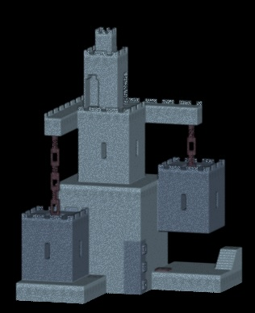

# vox-loader

The vox-loader is a NiiVue plugin that converts MagicaVoxel .vox volumes into NIfTI volumes. It uses the [vox-reader](https://www.npmjs.com/package/vox-reader) library to parse vox files. This is designed to be a minimal loader to illustrate NiiVue plugin loader design. Note that for more complex formats you would want to set the [spatial properties of the NIfTI header](https://brainder.org/2012/09/23/the-nifti-file-format/) (pixdim, sform).



## Usage

```javascript
import { Niivue } from '@niivue/niivue'
import { vox2nii } from '@niivue/vox-loader'

const nv = new Niivue()
await nv.attachToCanvas(document.getElementById('niivue-canvas'))
// supply loader function, fromExt, and toExt (without dots)
nv.useLoader(vox2nii, 'vox', 'nii')
await nv.loadImages([
  {
    url: '/example.vox'
  }
])
```

## Local Development

To illustrate this library, `vox2nii` is a node.js converter that can be run from the command line:

```
git clone git@github.com:niivue/niivue.git
cd packages/vox-loader
npm install
npm run build
npm run cli # tests the conversion
```

## Local Browser Development

You can also embed this loader into a hot-reloadable NiiVue web page to evaluate integration:

```
git clone git@github.com:niivue/niivue.git
cd packages/vox-loader
npm install
npm run dev
```

## Sample datasets

- [ephtracy provides sample models and the specification](https://github.com/ephtracy/voxel-model/tree/master). Note the sample model included in this repository is one of these models.

## Alternative libraries

Two similar libraries are provided. Both are equally simple for node usage, but the vox-reader is a bit simpler for web usage.

- [parse-magica-voxel](https://www.npmjs.com/package/parse-magica-voxel).
- [vox-reader](https://www.npmjs.com/package/vox-reader).
